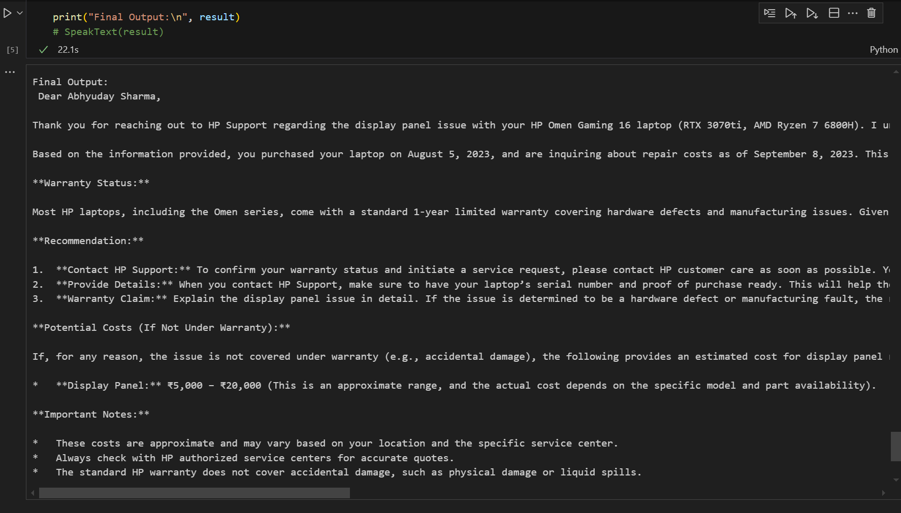

There is additional functionality(commented out in code) of Text2Speech and Speech2Text to give a more interactive experience.
For the input : "I am Abhyuday Sharma. My Hp omen Gaming 16 laptop with rtx 3070ti and amd ryzen 7 6800h has display panel issue. Can I know that how much will it cost to fix it? Date of Purchase is: 5 Aug 2023 and current date is 8 september 2023"

This was the output:

Output in text:
Final Output:
 Dear Abhyuday Sharma,

Thank you for reaching out to HP Support regarding the display panel issue with your HP Omen Gaming 16 laptop (RTX 3070ti, AMD Ryzen 7 6800H). I understand the inconvenience this may be causing you.

Based on the information provided, you purchased your laptop on August 5, 2023, and are inquiring about repair costs as of September 8, 2023. This means your laptop is approximately one month old.

**Warranty Status:**

Most HP laptops, including the Omen series, come with a standard 1-year limited warranty covering hardware defects and manufacturing issues. Given that your purchase was recent, it is highly likely that the display panel issue is covered under this warranty.

**Recommendation:**

1.  **Contact HP Support:** To confirm your warranty status and initiate a service request, please contact HP customer care as soon as possible. You can do this by visiting the HP support website or calling the HP customer care helpline for your region.
2.  **Provide Details:** When you contact HP Support, make sure to have your laptop’s serial number and proof of purchase ready. This will help them quickly verify your warranty status and guide you through the service process.
3.  **Warranty Claim:** Explain the display panel issue in detail. If the issue is determined to be a hardware defect or manufacturing fault, the repair or replacement should be covered under warranty.

**Potential Costs (If Not Under Warranty):**

If, for any reason, the issue is not covered under warranty (e.g., accidental damage), the following provides an estimated cost for display panel replacement:

*   **Display Panel:** ₹5,000 – ₹20,000 (This is an approximate range, and the actual cost depends on the specific model and part availability).

**Important Notes:**

*   These costs are approximate and may vary based on your location and the specific service center.
*   Always check with HP authorized service centers for accurate quotes.
*   The standard HP warranty does not cover accidental damage, such as physical damage or liquid spills.

**Additional Information:**

*   **HP Accessories Support:** Please note that accessories like chargers and adapters typically have a separate 1-year warranty.
*   **Extended Warranty:** If you have purchased an extended warranty or accidental damage protection (ADP), ensure you provide this information to HP Support, as it may affect the coverage and repair process.

We recommend contacting HP Support directly to ascertain the warranty coverage and obtain an accurate cost estimate for the repair. They will be able to provide the best assistance based on your specific situation.

We hope this information is helpful. Please let us know if you have any further questions.

Sincerely,

HP Report Generator
